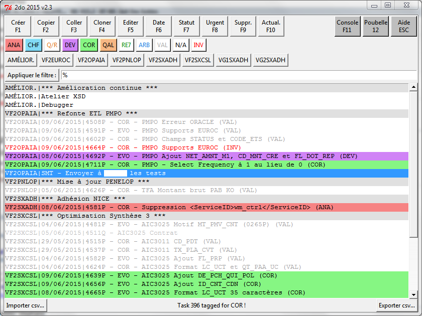
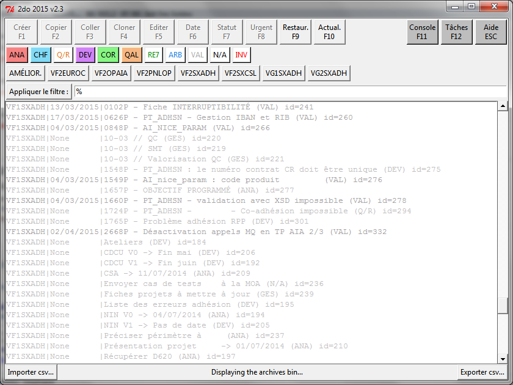
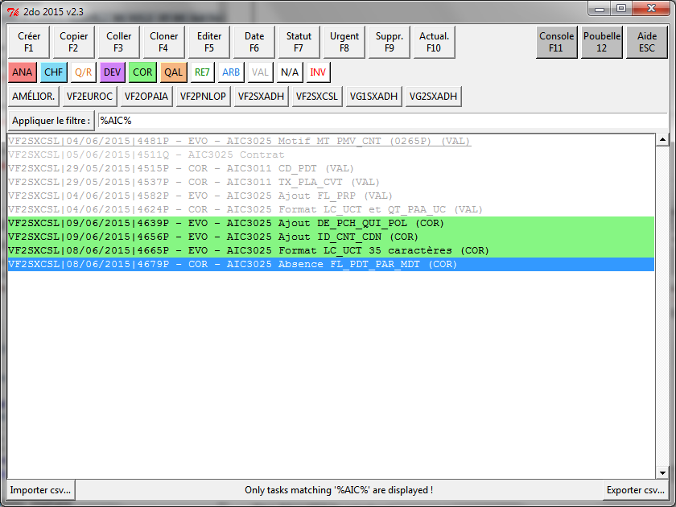
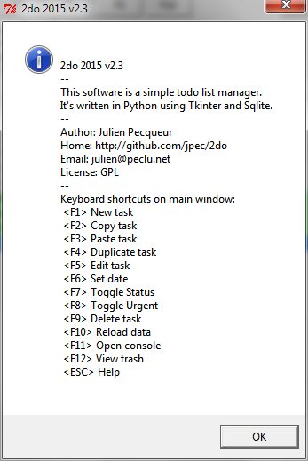

2do
===

This is a simple tasks manager i wrote for my daily usage at work.

The main interface is simple :

There is a recycle bin view to watch (and re-enable) the archived tasks :

The search box in usage :

The About/Help windows :

The console :

